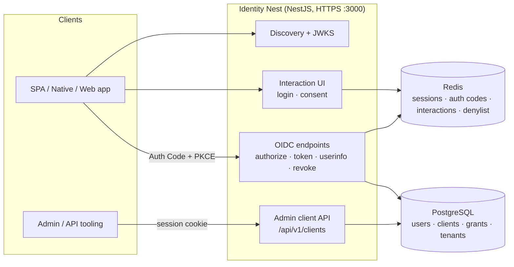

# Identity Nest — Documentation

Identity Nest is a [NestJS](https://nestjs.com/) **OAuth 2.0 Authorization Server / OpenID Connect Provider**. It implements the Authorization Code flow with PKCE, RS256-signed JWTs, JWKS publication, an OIDC discovery document, UserInfo, and RFC 7009 token revocation, plus an admin API for registering OAuth/OIDC clients.

> **Status: Work in progress.** The OIDC core flow is functional end-to-end. Many production concerns (migrations, MFA, rate limiting, audit logging, refresh-token rotation-with-revocation, multi-tenant enforcement) are tracked in [`../__planning/production_roadmap.md`](../__planning/production_roadmap.md) and are **not yet implemented**. This documentation describes the system **as it is built today**, and flags gaps where the running behavior differs from common expectations.

---

## Documentation map

| Document | What's inside |
| --- | --- |
| [Getting Started](#getting-started) (below) | Boot the stack locally and run your first flow |
| [Architecture](./architecture.md) | Tech stack, module map, component responsibilities, storage split, request lifecycle, security model |
| [API Reference](./api-reference.md) | Every endpoint: methods, parameters, responses, error codes, auth requirements |
| [Authentication Flows](./authentication-flows.md) | Sequence diagrams for authorize → consent → token, refresh, and revoke |
| [Data Model](./data-model.md) | Entity ERD, persistence split (Postgres vs Redis), Redis key reference, token claims |
| [Configuration](./configuration.md) | Environment variables, Docker deployment, TLS/keys, seeded data, troubleshooting |
| [API Testing Guide](../__projectDocs/api-testing.md) | Hands-on Postman / Bruno / Insomnia walkthroughs |

The interactive OpenAPI UI is served by the app itself at **`/api/docs`** (JSON at `/api/docs/openapi.json`) once it is running.

---

## Getting Started

### Prerequisites

- Node.js (project targets the `@types/node` 25 line; Node 20+ recommended)
- Docker + Docker Compose (for Postgres 17 and Redis 7)

### Boot the stack

```bash
cp .env.example .env            # first time only
docker compose up -d db redis   # start Postgres + Redis
npm install
npm run start:dev               # boots on https://localhost:3000
```

> The server runs over **HTTPS** using the self-signed certificate in
> `src/common/https/`. Expect a certificate warning in browsers and use
> `-k` / "disable TLS verify" in API clients for local development.

On startup (when `NODE_ENV !== production`) the app seeds a `default` tenant,
three users, three OAuth clients, and one pre-authorized grant. See
[Configuration → Seeded data](./configuration.md#seeded-data).

### Smoke test

```bash
# OIDC discovery document
curl -k https://localhost:3000/.well-known/openid-configuration

# JSON Web Key Set
curl -k https://localhost:3000/oidc/jwks.json
```

For a full browser-driven Authorization Code + PKCE run, follow the
[API Testing Guide](../__projectDocs/api-testing.md) or the
[Authentication Flows](./authentication-flows.md) document.

### Run the tests

```bash
npm run test        # unit (*.spec.ts)
npm run test:cov    # with coverage
npm run test:e2e    # end-to-end (needs Postgres + Redis up)
```

---

## At a glance



See [Architecture](./architecture.md) for the detailed view.
</content>
</invoke>
