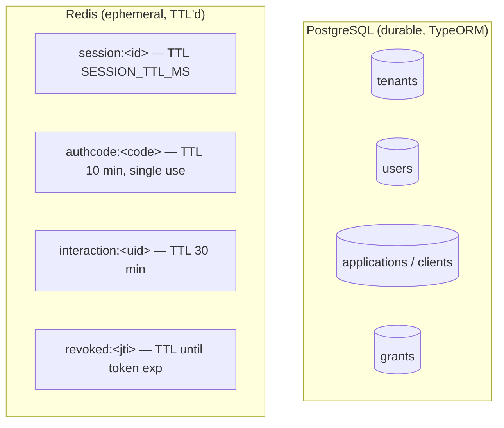
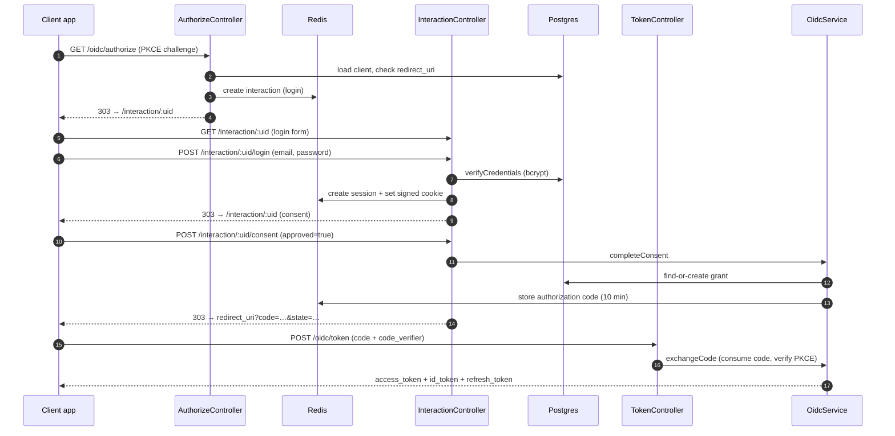

# Architecture

Identity Nest is a single NestJS application that acts as an **OAuth 2.0 Authorization Server and OpenID Connect Provider**. It is organized into feature modules under `src/modules/` and cross-cutting concerns under `src/common/`. Persistent identity data lives in **PostgreSQL** (via TypeORM); short-lived authorization state lives in **Redis**.

- [Technology stack](#technology-stack)
- [Module map](#module-map)
- [Component responsibilities](#component-responsibilities)
- [Storage split: Postgres vs Redis](#storage-split-postgres-vs-redis)
- [Request lifecycle](#request-lifecycle)
- [Security model](#security-model)
- [Known gaps & spec deviations](#known-gaps--spec-deviations)

---

## Technology stack

| Concern | Choice | Notes |
| --- | --- | --- |
| Runtime / framework | Node.js + NestJS 11 | Express platform (`@nestjs/platform-express`) |
| Language | TypeScript 6 | Compiled with `ts-loader`; tests via `ts-jest` |
| Persistent store | PostgreSQL 17 | TypeORM 0.3, `autoLoadEntities`, `synchronize` ON in non-prod |
| Cache / ephemeral store | Redis 7 | `ioredis`, keys namespaced by `REDIS_KEY_PREFIX` (default `idp:`) |
| JOSE / crypto | `jose` 6 | RS256 key generation, JWT sign/verify, JWKS export |
| Password / secret hashing | `bcrypt` (cost 12) | User passwords and client secrets |
| Validation | `class-validator` + `class-transformer` | Global `ValidationPipe` (whitelist + forbid non-whitelisted + transform) |
| API docs | `@nestjs/swagger` | Served at `/api/docs`, JSON at `/api/docs/openapi.json` |
| Config | `@nestjs/config` | Typed loader in `src/common/config/configuration.ts` |
| Transport | HTTPS | Self-signed cert/key in `src/common/https/` |

Application bootstrap (`src/main.ts`) wires: HTTPS server, CORS allowlist
(`CORS_ORIGINS`), `cookie-parser`, JSON + urlencoded body parsing, the global
validation pipe, and the Swagger document.

---

## Module map

```mermaid
graph TD
  App[AppModule]

  App --> Config[ConfigModule<br/>typed config]
  App --> TypeORM[TypeOrmModule<br/>Postgres]
  App --> Redis[RedisModule]
  App --> Oidc[OidcModule]
  App --> Client[ClientModule]
  App --> User[UserModule]
  App --> Store[StoreModule]
  App --> Auth[AuthModule]

  App -.controllers.-> AppC["AppController · GET /"]
  App -.controllers.-> Disc["DiscoveryController · /.well-known"]
  App -.controllers.-> Jwks["JwksController · /oidc/jwks.json"]

  Oidc --> Authorize["AuthorizeController · /oidc/authorize"]
  Oidc --> Token["TokenController · /oidc/token"]
  Oidc --> Userinfo["UserinfoController · /oidc/userinfo"]
  Oidc --> Revoke["RevokeController · /oidc/revoke"]
  Oidc --> Interaction["InteractionController · /interaction/:uid"]
  Oidc --> OidcSvc["OidcService + PKCE / denylist / client-auth / view"]

  Client --> ClientCtl["ClientController · /api/v1/clients"]
  Auth --> Session["SessionService + AdminGuard"]
  Store --> Stores[("Client / User / Grant Postgres stores + AuthCode / Interaction Redis stores")]
  Store --> Seed["SeedService · dev-only seeding"]
```

| Module | Path | Purpose |
| --- | --- | --- |
| `AppModule` | `src/app.module.ts` | Root wiring: config, DB, Redis, feature modules; mounts discovery + JWKS controllers |
| `OidcModule` | `src/modules/oidc/` | The OAuth/OIDC protocol surface and its supporting services |
| `ClientModule` | `src/modules/client/` | Admin REST API for client registration & secret rotation |
| `UserModule` | `src/modules/user/` | User lookup and credential verification |
| `AuthModule` | `src/modules/auth/` | Session lifecycle (`SessionService`) and `AdminGuard` |
| `StoreModule` | `src/modules/store/` | Data-access facades (stores) + dev `SeedService` |
| `RedisModule` | `src/common/cache/` | Redis client + `CacheService` (typed JSON helpers) |

Cross-cutting code lives in `src/common/`: `crypto/` (JWKS, JWT, keygen),
`controllers/` (discovery, JWKS), `guards/` (`BearerTokenGuard`),
`entities/` (TypeORM models), `config/`, `cache/`, `enums/`, `https/`.

---

## Component responsibilities

### OIDC protocol surface (`src/modules/oidc/`)

| Component | Responsibility |
| --- | --- |
| `AuthorizeController` | Validates `/authorize` params, resolves the client & redirect URI, checks PKCE policy, reuses an existing session/grant (skipping consent when scopes are already granted), and otherwise spawns a `login` or `consent` interaction. |
| `InteractionController` | Renders and processes the server-rendered login/consent HTML pages; on login success issues a session cookie; on consent completes the flow. |
| `TokenController` | Authenticates the client, then dispatches `authorization_code` and `refresh_token` grants to `OidcService`. |
| `UserinfoController` | Bearer-guarded; returns claims scoped by the access token's `scope`. |
| `RevokeController` | RFC 7009 revocation; authenticates the client and delegates to `OidcService.revokeToken`. |
| `OidcService` | Core logic: `completeConsent` (grant + auth code + redirect), `exchangeCode` (PKCE verify + token minting), `refreshTokens`, `revokeToken`. |
| `PkceService` | Verifies `code_verifier` against the stored `code_challenge` (`S256` / `plain`). |
| `ClientAuthenticatorService` | Resolves client credentials from `client_secret_basic` (Authorization header) or `client_secret_post` (body); validates the bcrypt secret. |
| `TokenDenylistService` | Tracks revoked access-token `jti`s in Redis until their `exp`. |
| `InteractionViewService` | Produces the self-contained login/consent HTML (with HTML escaping). |

### Crypto (`src/common/crypto/`)

| Component | Responsibility |
| --- | --- |
| `JwksService` | Generates an RS256 key pair on startup (in memory), exposes the JWKS, the active signing key, and key lookup by `kid`. Supports rotation. |
| `JwtService` | Signs ID tokens (`typ: JWT`, 5 min), access tokens (`typ: at+jwt`, RFC 9068, default 1 h), and refresh tokens (`typ: rt+jwt`, default 30 d); verifies any token by resolving `kid`. |
| `KeygenService` | Key-generation helper utilities. |

### Identity & access (`src/modules/`)

| Component | Responsibility |
| --- | --- |
| `UserService` / `UserStore` | Find users by id/email; verify bcrypt passwords. |
| `ClientService` / `ClientStore` | Register clients (opaque id + secret, per-type secure defaults, redirect-URI validation), list/get, rotate secrets. Secrets are bcrypt-hashed; plaintext is returned **once**. |
| `GrantStore` | Persists user→client consent grants (scopes), find-or-create with scope union, revoke. |
| `SessionService` | Creates/validates Redis-backed sessions; HMAC-signs/unsigns the session cookie (`COOKIE_SECRET`) using a timing-safe comparison. |
| `AdminGuard` | Validates the signed session cookie and checks the user email against `ADMIN_EMAILS`. |
| `BearerTokenGuard` | Verifies the access-token JWT and rejects denylisted `jti`s; attaches the payload to the request. |

---

## Storage split: Postgres vs Redis

The system deliberately separates **durable identity records** from
**short-lived protocol state**.

| Data | Store | Lifetime | Owner |
| --- | --- | --- | --- |
| Tenants, Users, Clients, Grants | Postgres | Durable | `*Store` classes (TypeORM) |
| Login/consent sessions | Redis | `SESSION_TTL_MS` (default 1 h) | `SessionService` |
| Authorization codes | Redis | 10 min, consumed on use | `AuthorizationCodeStore` |
| Interactions (pending authorize) | Redis | 30 min | `InteractionStore` |
| Revoked access-token `jti`s | Redis | Until token `exp` | `TokenDenylistService` |
| Signing keys (JWKS) | **In-memory** | Process lifetime | `JwksService` |

> **Operational note:** signing keys are generated in memory at boot and are
> **not persisted**. Restarting the app generates a fresh `kid`, which
> invalidates all previously issued JWTs (their `kid` no longer resolves). This
> is acceptable for development but must be replaced with a persistent key store
> before any multi-instance or production deployment.

See [Data Model](./data-model.md) for the full entity ERD and Redis key reference.

---

## Request lifecycle

A browser-based Authorization Code + PKCE sign-in touches most of the system:

See [Authentication Flows](./authentication-flows.md) for refresh and revoke diagrams and the consent-skip fast path.

---

## Security model

- **Transport:** HTTPS only (self-signed cert locally; replace in production).
- **PKCE:** Required per-client (`requirePkce`). Public clients (`spa`/`native`,
  auth method `none`) always require it. When required, `plain` is rejected at
  `/authorize` and only `S256` is accepted.
- **Client authentication:** `client_secret_basic` or `client_secret_post`;
  secrets are bcrypt-hashed at rest and compared with bcrypt. Public clients
  authenticate with `client_id` only.
- **Sessions:** Random UUID stored in Redis; the cookie carries
  `sessionId.HMAC-SHA256(sessionId, COOKIE_SECRET)` and is verified with a
  timing-safe comparison. Cookie flags: `httpOnly`, `sameSite=lax`, `path=/`.
- **Tokens:** RS256 JWTs. Access tokens carry `jti`; revocation adds the `jti`
  to a Redis denylist checked by `BearerTokenGuard`. ID tokens are short-lived
  (5 min) and may carry `nonce`, `auth_time`, `email`, `email_verified`,
  `preferred_username`.
- **Authorization codes:** 256-bit random, single-use (`getJsonAndDelete`),
  10-minute TTL, bound to client + redirect URI + PKCE challenge.
- **Admin API:** Guarded by `AdminGuard` — valid session **and** the user email
  must appear in `ADMIN_EMAILS`. (Explicitly a demo-grade check; production RBAC
  is on the roadmap.)
- **Revocation endpoint:** Always returns `200` for success and unknown/invalid
  tokens (no validity oracle); only client-auth failure returns `401`.

---

## Known gaps & spec deviations

These are accurate descriptions of current behavior, to prevent surprises:

| Area | Current behavior | Expectation / roadmap |
| --- | --- | --- |
| Refresh tokens | `refreshTokens()` issues a **new** refresh token but does **not** invalidate the old one. Previously issued refresh tokens remain valid until they expire. | Rotation **with** family-based replay detection is roadmap M4. Do not rely on one-time-use refresh tokens today. |
| `registration_endpoint` | Discovery advertises `/connect/register`, but **no such endpoint is implemented**. Client registration is the admin API at `/api/v1/clients`. | Dynamic client registration is not yet built. |
| `code_challenge_methods_supported` | Discovery advertises `['S256']`, but `/authorize` also accepts `plain` and **defaults to `plain`** when the method is omitted (unless the client requires PKCE). | Treat `S256` as the supported method; always send it explicitly. |
| Login field | The login form and `LoginDto` use **`email`** (validated as an email), not `username`. Combined with `forbidNonWhitelisted`, posting `username` is rejected. | Sign in with the user's email (e.g. `test@example.com`). |
| Signing keys | Generated in memory at boot; not persisted; rotate on restart. | Persistent/rotatable key store needed for production. |
| Multi-tenant isolation | A `default` tenant is auto-created; tenant scoping is **not enforced** at the query layer. | Tenant-scoped repositories + RLS are roadmap M1. |
| `client_credentials` grant | Accepted by the token DTO enum but returns `unsupported_grant_type`. | Service-to-service grant not implemented. |
| `synchronize: true` | Schema is auto-synced in non-production; no migrations exist. | Migrations are roadmap M1. |
</content>
