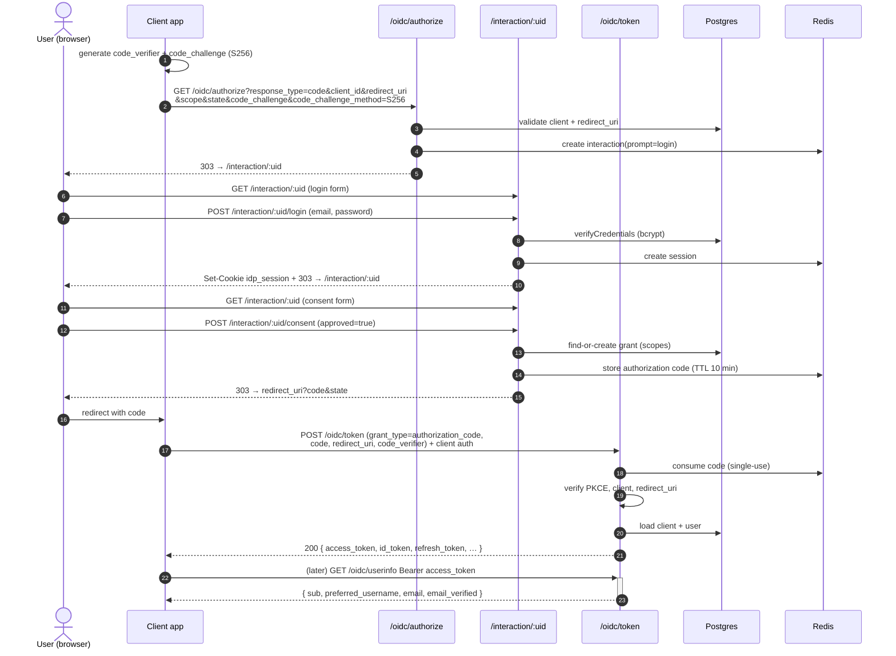
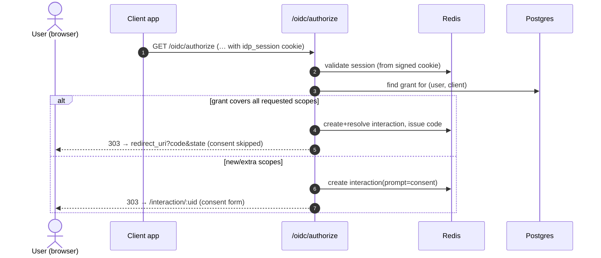
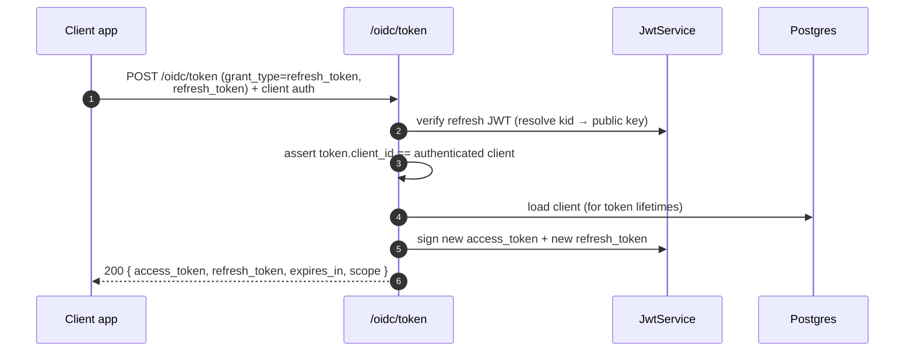
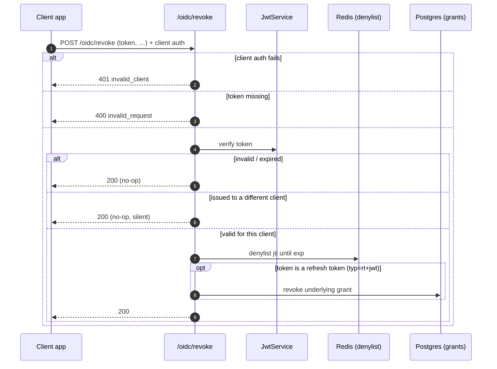

# Authentication Flows

Sequence diagrams for the flows Identity Nest implements today, traced directly from the controllers and `OidcService`. Diagrams render natively on GitHub (Mermaid).

- [Authorization Code + PKCE (full sign-in)](#authorization-code--pkce-full-sign-in)
- [Consent-skip fast path](#consent-skip-fast-path)
- [Implicit & hybrid flows](#implicit--hybrid-flows)
- [Refresh token grant](#refresh-token-grant)
- [Token revocation](#token-revocation)
- [Error & denial redirects](#error--denial-redirects)
- [Generating PKCE values](#generating-pkce-values)

The **Authorization Code + PKCE** flow below is the primary, recommended path —
a `code_challenge` is required on `/authorize` for any response type that
returns a code. The server also implements the implicit, hybrid, and `none`
response types (see [Implicit & hybrid flows](#implicit--hybrid-flows)); those
return tokens directly from `/authorize` and carry no PKCE.

---

## Authorization Code + PKCE (full sign-in)

The complete first-time sign-in: no existing session, so the user logs in and
consents before a code is issued and exchanged for tokens.



**Key checks performed during code exchange** (`OidcService.exchangeCode`):

1. The code exists, is unexpired, and has not been used (it is deleted on read).
2. `client_id` matches the client the code was issued to.
3. `redirect_uri` matches the one bound to the code.
4. The PKCE `code_verifier` matches the stored `code_challenge`/method.
5. The client and user still exist.

Only then are the three tokens minted (in parallel).

---

## Consent-skip fast path

If the user already has a **valid session** and a **grant covering all requested
scopes**, `/oidc/authorize` issues a code immediately — no login, no consent
page. This is what the seeded `test@example.com` → `dashboard-spa` grant
enables.



If the session cookie is missing or invalid, the flow falls back to the full
[login flow](#authorization-code--pkce-full-sign-in).

---

## Implicit & hybrid flows

For non-code response types, `OidcService.completeConsent` mints the requested
artifacts at the authorize/consent step instead of deferring to `/oidc/token`,
and returns them in the redirect **fragment** (the default `response_mode` for
token-bearing responses; `query` is refused).

| `response_type` | Flow | Returned to `redirect_uri` (fragment) |
| --- | --- | --- |
| `id_token` | Implicit | `id_token`, `state` |
| `id_token token` | Implicit | `id_token`, `access_token`, `token_type`, `expires_in`, `scope`, `state` |
| `code id_token` | Hybrid | `code`, `id_token`, `state` |
| `code token` | Hybrid | `code`, `access_token`, `token_type`, `expires_in`, `scope`, `state` |
| `code id_token token` | Hybrid | `code`, `id_token`, `access_token`, `token_type`, `expires_in`, `scope`, `state` |
| `none` | — | `state` only (no code/tokens; grant still recorded) |

Rules enforced at `/authorize` for these flows:

- **`nonce` is required** whenever an `id_token` is returned, and **`scope` must
  include `openid`**.
- **No PKCE** for implicit (no code); hybrid still requires `code_challenge`
  because it returns a code.
- ID tokens issued here include **`at_hash`** (when an access token is in the
  same response) and **`c_hash`** (when a code is), binding them together
  (OIDC Core §3.3.2.11).

Hybrid `code` values are still exchanged at `/oidc/token` exactly as in the code
flow. Implicit is retained for OIDC certification coverage; new integrations
should prefer Authorization Code + PKCE.

---

## Refresh token grant



> ⚠ The old refresh token is **not** revoked or denylisted — it stays valid
> until it expires. There is no replay/family detection yet (roadmap M4).

---

## Token revocation

RFC 7009. Returns `200` in (almost) all cases so the endpoint can't be used to
probe token validity.



After revocation, `BearerTokenGuard` rejects any access token whose `jti` is on
the denylist; and because the grant is revoked, subsequent refreshes fail.

---

## Error & denial redirects

Where the OAuth spec calls for it, `/authorize` and the consent step communicate
failures by **redirecting back to the client** with `error` parameters:

Redirected errors land in the query string or fragment to match the request's
response mode.

| Situation | Result |
| --- | --- |
| Unsupported `response_type` / `response_mode` | `303 → redirect_uri` with `error=unsupported_response_type` / `invalid_request` (`&state`) |
| Missing `code_challenge` (code/hybrid), missing `nonce` or `openid` (id_token flows) | `303 → redirect_uri?error=invalid_request` (or `invalid_scope`) `&…&state=…` |
| Unsupported `code_challenge_method`, or `plain` when PKCE is required | `303 → redirect_uri?error=invalid_request&error_description=…&state=…` |
| User denies consent | `303 → redirect_uri?error=access_denied&…&state=…` |
| Interaction aborted (`GET /interaction/:uid/abort`) | `303 → redirect_uri?error=access_denied&…&state=…` |
| Unknown/inactive client, or unregistered `redirect_uri` | `400` JSON (no redirect — avoids open-redirect to an untrusted URI) |
| Missing core params (`response_type`/`client_id`/`redirect_uri`/`scope`) | `400` JSON `{ "error": "invalid_request" }` |

---

## Generating PKCE values

If your tooling doesn't generate PKCE pairs, produce them with Python 3:

```bash
python3 -c "
import os, hashlib, base64
v = base64.urlsafe_b64encode(os.urandom(32)).rstrip(b'=').decode()
c = base64.urlsafe_b64encode(hashlib.sha256(v.encode()).digest()).rstrip(b'=').decode()
print('code_verifier =', v)
print('code_challenge =', c)
"
```

Use `code_challenge` (with `code_challenge_method=S256`) at `/oidc/authorize`,
and the matching `code_verifier` at `/oidc/token`.

For full, tool-specific walkthroughs (Postman, Bruno, Insomnia), see the
[API Testing Guide](../__projectDocs/api-testing.md).
</content>
