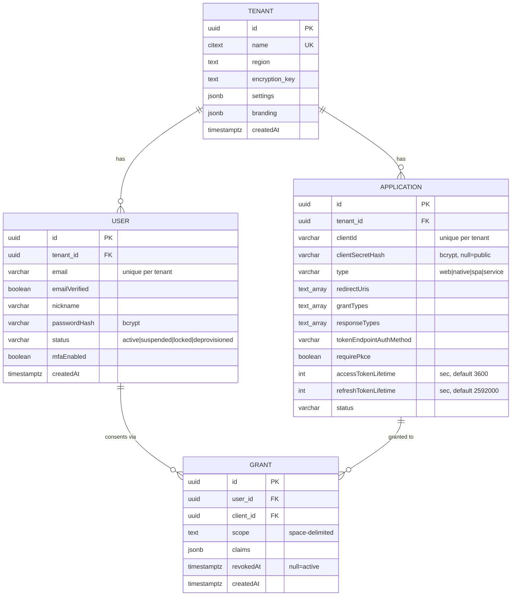

# Data Model

Identity Nest splits state between **PostgreSQL** (durable identity records, via TypeORM) and **Redis** (short-lived protocol state, via `CacheService`). Many entities are *defined* in `src/common/entities/` as scaffolding for the [roadmap](../__planning/production_roadmap.md) but are **not yet wired to any API** — this document is explicit about which is which.

- [Active relational model (ERD)](#active-relational-model-erd)
- [Entity inventory](#entity-inventory)
- [Redis key reference](#redis-key-reference)
- [Token claims reference](#token-claims-reference)

---

## Active relational model (ERD)

These four entities are read/written by the running code (stores + seed). All
carry a `tenant_id` FK; a single `default` tenant is auto-created today.

Notes:

- `USER` is unique on `(tenant_id, email)`; `APPLICATION` on
  `(tenant_id, clientId)`; `GRANT` on `(user, client)`.
- The `applications` table is mapped by the `ClientApplication` entity (the
  table name is `applications`). There is also an unused `client.entity.ts` that
  is **commented out** of the entity index.
- `GRANT.scope` is a space-delimited string; `GrantStore.findOrCreate` performs a
  scope **union** when a grant already exists.

---

## Entity inventory

All entities live in `src/common/entities/` and are exported from
`entities/index.ts`. Because TypeORM `autoLoadEntities` + `synchronize` is on in
non-production, **every** listed entity's table is created — but only the
"Active" ones are actually used by application logic.

| Entity | Table | Status | Used by |
| --- | --- | --- | --- |
| `Tenant` | `tenant` | ✅ Active | `ClientStore`, `SeedService` (single `default` tenant) |
| `User` | `users` | ✅ Active | `UserStore`, `UserService`, guards, seed |
| `ClientApplication` | `applications` | ✅ Active | `ClientStore`, `ClientService`, seed |
| `Grant` | `grants` | ✅ Active | `GrantStore`, `OidcService` |
| `Credential` | `credentials` | ⏳ Defined, not wired | (roadmap: MFA factors) |
| `Session` | `sessions` | ⏳ Defined, not wired | Sessions currently live in **Redis**, not this table |
| `AccessToken` | `access_tokens` | ⏳ Defined, not wired | Access tokens are stateless JWTs |
| `RefreshToken` | `refresh_tokens` | ⏳ Defined, not wired | Refresh tokens are stateless JWTs |
| `ConsentRecord` | `consent_records` | ⏳ Defined, not wired | Consent is captured via `Grant` |
| `Organization` | `organizations` | ⏳ Defined, not wired | (roadmap M5) |
| `Group` | `groups` | ⏳ Defined, not wired | (roadmap M5) |
| `UserGroupMembership` | `user_group_membership` | ⏳ Defined, not wired | (roadmap M5) |
| `Policy` | `policies` | ⏳ Defined, not wired | (roadmap M6) |
| `AuditLog` | `audit_logs` | ⏳ Defined, not wired | (roadmap M2) |

> The aspirational full schema (multi-tenant SaaS IdP) is documented in
> [`../__planning/plan_overview.md`](../__planning/plan_overview.md). Treat it as
> a target, not a description of current behavior.

---

## Redis key reference

All keys are additionally prefixed by `REDIS_KEY_PREFIX` (default `idp:`), so the
effective key for a session is e.g. `idp:session:<uuid>`. Access is via
`CacheService` (`getJson`, `setJson`, `getJsonAndDelete`, `setJsonKeepTtl`,
`delete`, `exists`, `ttl`).

| Key pattern | Written by | TTL | Value | Semantics |
| --- | --- | --- | --- | --- |
| `session:<sessionId>` | `SessionService` | `SESSION_TTL_MS` (default 1 h) | `{ sessionId, userId, authenticatedAt, expiresAt }` | Browser/admin login session. Looked up from the signed `idp_session` cookie. |
| `authcode:<code>` | `AuthorizationCodeStore` | 10 min | code metadata (client, user, grant, redirect, scope, nonce, PKCE) | OAuth authorization code. **Single-use** — read with `GETDEL`. |
| `interaction:<uid>` | `InteractionStore` | 30 min | `{ uid, prompt, params, userId, … }` | Pending `/authorize` request awaiting login/consent. |
| `revoked:<jti>` | `TokenDenylistService` | until token `exp` | `{ revokedAt }` | Denylist for revoked access-token `jti`s; checked by `BearerTokenGuard`. |

**Cookie ↔ session linkage:** the `idp_session` cookie value is
`sessionId.HMAC_SHA256(sessionId, COOKIE_SECRET)`. `SessionService.unsign`
verifies the HMAC (timing-safe) before the `sessionId` is used to fetch
`session:<sessionId>` from Redis.

---

## Token claims reference

All tokens are RS256 JWTs signed by `JwtService` using the active JWKS key. The
`typ` header distinguishes the three token kinds.

### ID token — `typ: JWT`, TTL 5 min

| Claim | Source |
| --- | --- |
| `sub` | User id |
| `aud` | `client_id` |
| `iss` | `OIDC_ISSUER` |
| `iat`, `exp` | Issued-at / +300 s |
| `nonce` | From `/authorize` (if provided) |
| `auth_time` | Time of code exchange |
| `email`, `email_verified` | User record |
| `preferred_username` | User `nickname` (falls back to `email`) |

### Access token — `typ: at+jwt` (RFC 9068), TTL `accessTokenLifetime` (default 3600 s)

| Claim | Source |
| --- | --- |
| `sub` | User id |
| `client_id` | Authenticated client |
| `scope` | Granted scope string |
| `jti` | Random UUID (used for revocation) |
| `aud` | `OIDC_ISSUER` (override-able) |
| `iss`, `iat`, `exp` | Standard |
| `tenant_id` | Only if supplied (not set by current flows) |

### Refresh token — `typ: rt+jwt`, TTL `refreshTokenLifetime` (default 2592000 s / 30 d)

| Claim | Source |
| --- | --- |
| `sub` | User id |
| `client_id` | Authenticated client |
| `scope` | Granted scope string |
| `jti` | Random UUID |
| `iss`, `iat`, `exp` | Standard |

> Access and refresh tokens are **self-contained JWTs**, not database rows. They
> are validated by signature + expiry (and, for access tokens, the `jti`
> denylist). The `AccessToken` / `RefreshToken` entities exist for a future
> stateful model but are not populated today.
</content>
