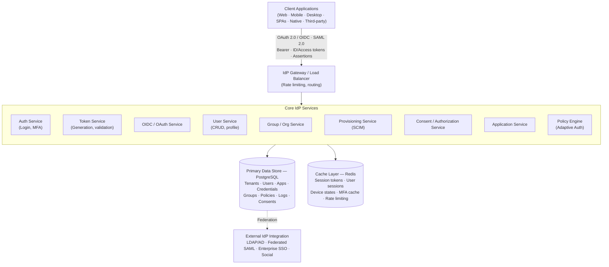
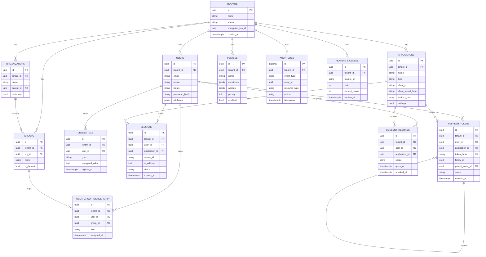
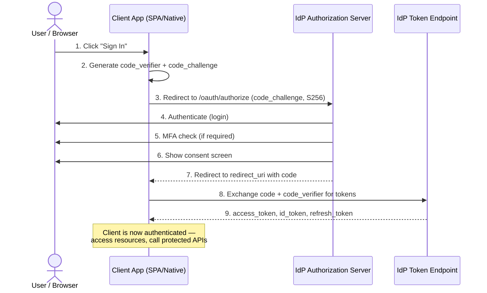
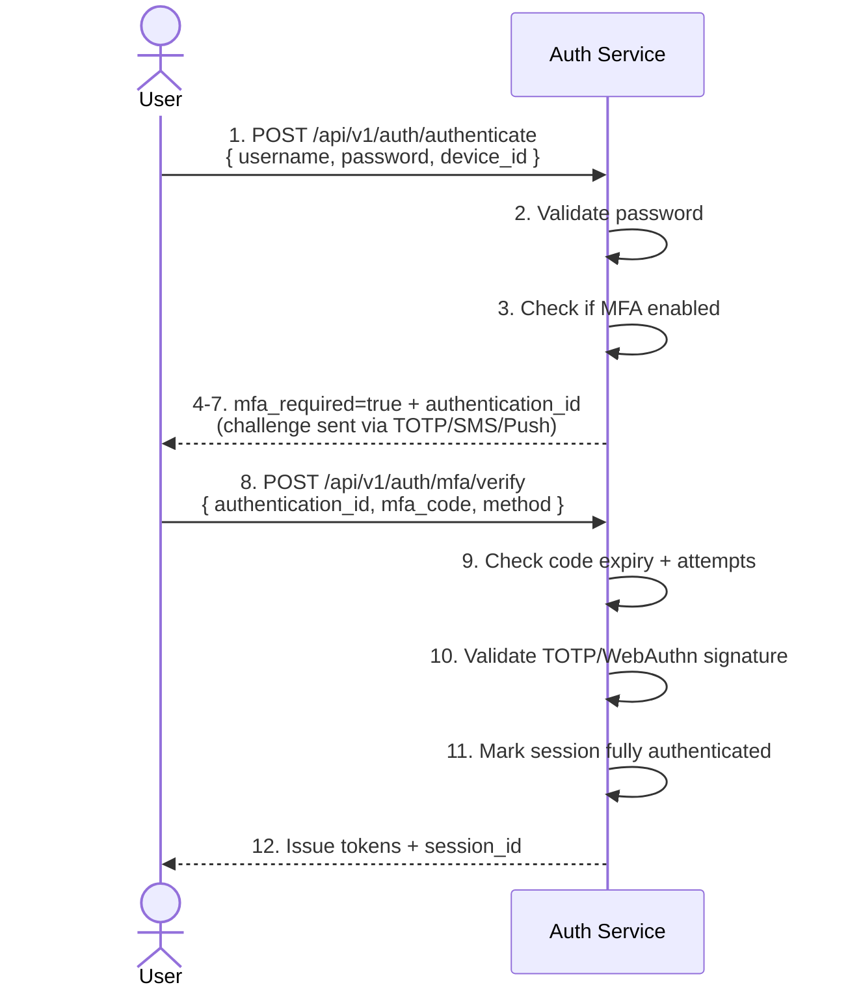
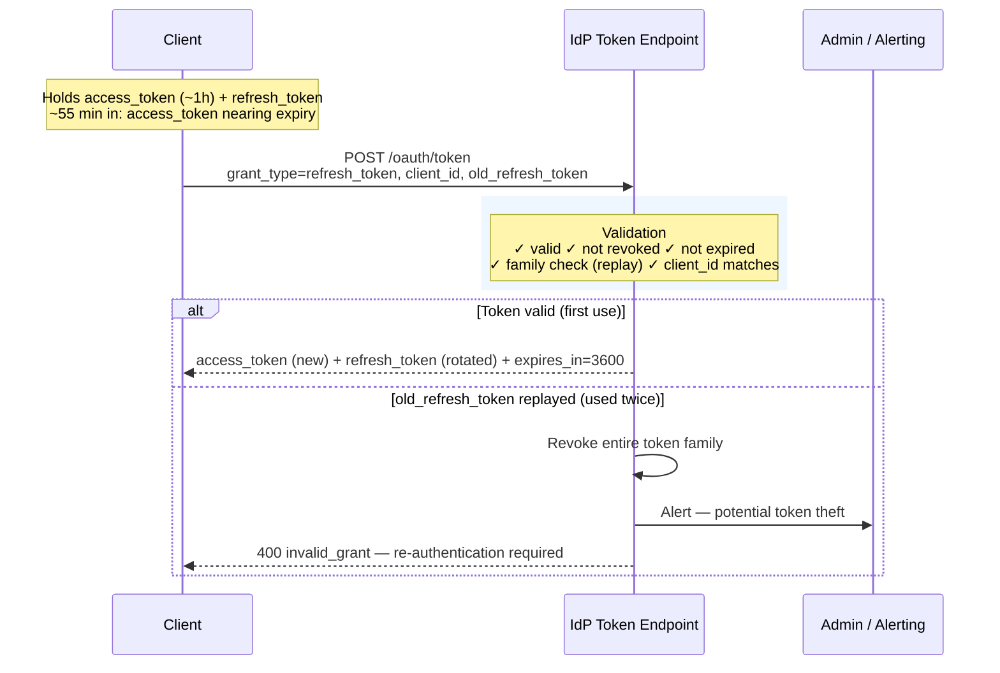
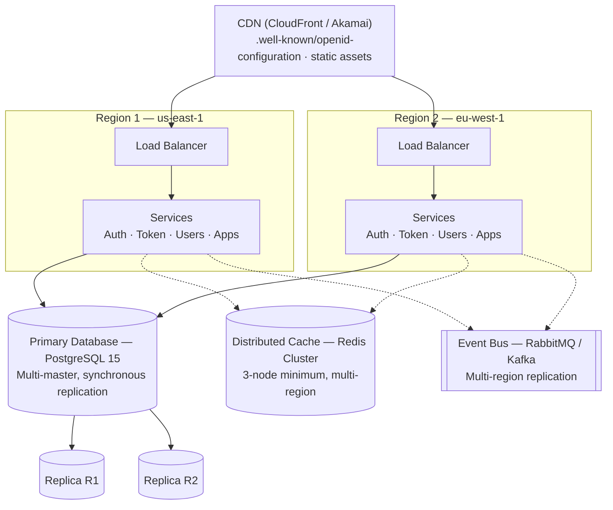

# Multi-Tenant Identity Provider (IdP) Architecture

## Executive Summary

This document provides a comprehensive architectural blueprint for building a production-grade, multi-tenant Identity Provider (IdP) similar to Okta, Auth0, or Azure AD. It covers system architecture, data models, database schemas, API interfaces, and security considerations for a SaaS identity platform serving multiple enterprise customers.

---

## Table of Contents

1. [System Architecture Overview](#system-architecture-overview)
2. [Core Components](#core-components)
3. [Data Models & Schema](#data-models--schema)
4. [API Interfaces](#api-interfaces)
5. [Authentication Flows](#authentication-flows)
6. [Security Architecture](#security-architecture)
7. [Scalability & Performance](#scalability--performance)
8. [Deployment Architecture](#deployment-architecture)

---

## System Architecture Overview

### High-Level Architecture Diagram

### Core Principles

**1. Tenant Isolation (Critical)**
- Logical isolation via `tenant_id` on all data
- Row-level security (RLS) enforced at database layer
- Separate encryption keys per tenant
- Complete data segregation for compliance

**2. API-First Design**
- Microservices architecture with independent scaling
- RESTful APIs for all operations
- Event-driven communication for async workflows
- Clear service boundaries

**3. Security by Default**
- Zero-trust authentication model
- End-to-end encryption for sensitive data
- Audit logging on all operations
- Rate limiting and DDoS protection

**4. High Availability & Scalability**
- Horizontal scaling of all services
- Multi-region deployment capability
- No single points of failure
- Regional data residency options

---

## Core Components

### 1. Authentication Service

**Responsibilities:**
- User credential validation
- Session management
- Multi-factor authentication (MFA)
- Adaptive authentication policies
- Password reset workflows

**Key Interfaces:**
POST /api/v1/auth/authenticate
  Request: { tenant_id, username, password, mfa_code }
  Response: { session_id, session_token, mfa_required }

POST /api/v1/auth/mfa/verify
  Request: { session_id, mfa_code }
  Response: { access_token, id_token, refresh_token }

POST /api/v1/auth/logout
  Request: { session_id, refresh_token }
  Response: { success }

**Features:**
- Passwordless authentication (WebAuthn, email OTP)
- Step-up authentication for sensitive operations
- Session timeout and renewal
- Concurrent session limits
- Device fingerprinting and trust

### 2. Token Service

**Responsibilities:**
- OAuth 2.0 token issuance
- JWT generation and signing
- Token validation and introspection
- Token revocation
- Refresh token management

**Token Types:**
- **Access Token**: Short-lived (15-60 minutes), scope-based
- **ID Token**: OIDC token with user claims
- **Refresh Token**: Long-lived (days to months), rotated on use
- **Assertion Token**: SAML assertions for federated access

**Key Interfaces:**
POST /oauth/token
  Request: { grant_type, client_id, client_secret, code }
  Response: { access_token, token_type, expires_in, id_token }

POST /oauth/introspect
  Request: { token, token_type_hint }
  Response: { active, scope, exp, sub, aud }

POST /oauth/revoke
  Request: { token }
  Response: { success }

### 3. OIDC/OAuth Service

**Responsibilities:**
- OAuth 2.0 Authorization Server implementation
- OpenID Connect provider
- Authorization code flow
- Implicit/hybrid flows (legacy)
- Client credentials flow (for service-to-service)
- PKCE support for native apps

**Supported Flows:**
1. **Authorization Code** (most secure for web apps)
2. **Authorization Code + PKCE** (required for native/SPA)
3. **Client Credentials** (service-to-service)
4. **Device Authorization** (IoT/limited-input devices)
5. **Refresh Token** (token refresh)

**Key Interfaces:**
GET /oauth/authorize
  Query: { client_id, redirect_uri, scope, state, response_type }
  Response: { redirect to redirect_uri with code/token }

POST /oauth/token
  Request: { grant_type, code, code_verifier, ... }
  Response: { access_token, id_token, refresh_token }

GET /.well-known/openid-configuration
  Response: { authorization_endpoint, token_endpoint, ... }

GET /oauth/userinfo
  Header: { Authorization: Bearer access_token }
  Response: { sub, email, name, custom_claims }

### 4. User Service

**Responsibilities:**
- User CRUD operations
- Profile management
- User attributes and custom claims
- User search and filtering
- User deprovisioning/deletion
- Password management

**Key Interfaces:**
GET /api/v1/users?tenant_id=xxx
  Response: { users: [], total, page, per_page }

GET /api/v1/users/{user_id}
  Response: { id, email, name, groups, attributes, ... }

POST /api/v1/users
  Request: { email, name, password, attributes }
  Response: { user: { id, email, ... } }

PATCH /api/v1/users/{user_id}
  Request: { email, name, phone, custom_attributes }
  Response: { user: {...} }

DELETE /api/v1/users/{user_id}
  Response: { success }

### 5. Group/Organization Service

**Responsibilities:**
- Organization management (multi-level)
- Group management
- Dynamic group rules
- User-group mappings
- Group-based access control
- Team management

**Key Interfaces:**
GET /api/v1/orgs?tenant_id=xxx
  Response: { organizations: [], total }

POST /api/v1/orgs
  Request: { name, description, parent_org_id }
  Response: { org: { id, name, ... } }

GET /api/v1/groups/{org_id}
  Response: { groups: [], total }

POST /api/v1/groups
  Request: { org_id, name, description, rule }
  Response: { group: {...} }

POST /api/v1/groups/{group_id}/members
  Request: { user_id }
  Response: { success }

### 6. Application/Integration Service

**Responsibilities:**
- Application registration and management
- OAuth client credentials management
- API key generation
- Redirect URI validation
- Application-level policies
- Integration configuration (SAML, LDAP, etc.)

**Key Interfaces:**
POST /api/v1/apps
  Request: { name, type, redirect_uris, logo_uri, custom_domain }
  Response: { app: { id, client_id, client_secret, ... } }

GET /api/v1/apps/{app_id}
  Response: { app: {...} }

PATCH /api/v1/apps/{app_id}/secret/rotate
  Response: { client_secret }

GET /api/v1/apps/{app_id}/settings
  Response: { saml_config, oidc_config, ldap_config, ... }

### 7. Provisioning Service (SCIM)

**Responsibilities:**
- System for Cross-domain Identity Management (SCIM 2.0)
- User provisioning automation
- Group provisioning
- Just-In-Time (JIT) provisioning
- Directory synchronization

**Key Interfaces:**
GET /scim/v2/Users?filter=userName eq "john@example.com"
  Response: { schemas, totalResults, Resources: [...] }

POST /scim/v2/Users
  Request: { schemas, userName, name, emails }
  Response: { id, userName, ... }

PUT /scim/v2/Users/{user_id}
  Request: { schemas, id, userName, ... }
  Response: { id, ... }

GET /scim/v2/Groups
  Response: { schemas, Resources: [...] }

### 8. Policy Engine (Adaptive Authentication)

**Responsibilities:**
- Conditional access policies
- Risk-based authentication
- Geo-location based rules
- Device compliance checks
- Step-up authentication requirements
- IP whitelist/blacklist management

**Policy Components:**
- **Conditions**: location, device, time, IP, risk score
- **Actions**: allow, deny, require MFA, require step-up auth
- **Rules**: AND/OR logic, priority-based evaluation

**Key Interfaces:**
POST /api/v1/policies
  Request: { name, conditions, actions, priority }
  Response: { policy: {...} }

POST /api/v1/policies/{policy_id}/evaluate
  Request: { user_id, context: { ip, device, location, ... } }
  Response: { allowed, required_factors, required_actions }

### 9. Audit & Logging Service

**Responsibilities:**
- Immutable audit logs
- Event streaming
- Compliance logging (HIPAA, SOC 2, GDPR)
- Real-time alerting
- Log retention policies
- Sensitive data redaction

**Events Logged:**
- Authentication attempts (success/failure)
- Token operations
- User CRUD operations
- Policy changes
- Administrative actions
- Suspicious activities

**Key Interfaces:**
GET /api/v1/audit/logs?tenant_id=xxx&filter=event_type
  Response: { logs: [], total, page }

GET /api/v1/audit/events/{event_id}
  Response: { event: { id, type, actor, resource, timestamp, ... } }

---

## Data Models & Schema

### Entity Relationship Diagram (ERD)

### Core Tables: Detailed Schema

#### Tenants Table
CREATE TABLE tenants (
  id UUID PRIMARY KEY DEFAULT gen_random_uuid(),
  name VARCHAR(255) NOT NULL,
  display_name VARCHAR(255),
  status VARCHAR(50) DEFAULT 'active', -- active, suspended, deleted
  tier VARCHAR(50) DEFAULT 'standard', -- free, standard, professional, enterprise
  
  -- Data residency & encryption
  region VARCHAR(50) DEFAULT 'us-east-1',
  encryption_key_id UUID NOT NULL,
  
  -- Custom branding
  branding JSONB, -- logo_url, primary_color, custom_domain
  
  -- Configuration
  settings JSONB DEFAULT '{}', -- mfa_required, session_timeout, password_policy
  
  -- Contact & billing
  admin_email VARCHAR(255),
  plan_id UUID,
  billing_email VARCHAR(255),
  
  -- Metadata
  metadata JSONB DEFAULT '{}',
  created_at TIMESTAMPTZ DEFAULT CURRENT_TIMESTAMP,
  updated_at TIMESTAMPTZ DEFAULT CURRENT_TIMESTAMP,
  deleted_at TIMESTAMPTZ,
  
  -- Indexes
  CONSTRAINT active_tenants CHECK (deleted_at IS NULL),
  INDEX idx_status (status),
  INDEX idx_region (region),
  UNIQUE INDEX idx_encryption_key_id (encryption_key_id)
);

#### Users Table
CREATE TABLE users (
  id UUID PRIMARY KEY DEFAULT gen_random_uuid(),
  tenant_id UUID NOT NULL REFERENCES tenants(id),
  
  -- Identity
  email VARCHAR(255) NOT NULL,
  email_verified BOOLEAN DEFAULT FALSE,
  email_verified_at TIMESTAMPTZ,
  
  phone VARCHAR(20),
  phone_verified BOOLEAN DEFAULT FALSE,
  
  -- Profile
  given_name VARCHAR(255),
  family_name VARCHAR(255),
  middle_name VARCHAR(255),
  nickname VARCHAR(255),
  profile_picture_url TEXT,
  
  -- Account status
  status VARCHAR(50) DEFAULT 'active', 
  -- active, suspended, deprovisioned, locked
  
  -- Password
  password_hash VARCHAR(255), -- bcrypt or Argon2
  password_changed_at TIMESTAMPTZ,
  password_expires_at TIMESTAMPTZ,
  
  -- Custom attributes
  attributes JSONB DEFAULT '{}',
  
  -- MFA & Security
  mfa_enabled BOOLEAN DEFAULT FALSE,
  mfa_methods JSONB DEFAULT '[]', -- TOTP, WebAuthn, SMS
  last_login TIMESTAMPTZ,
  login_count INTEGER DEFAULT 0,
  failed_login_attempts INTEGER DEFAULT 0,
  locked_until TIMESTAMPTZ,
  
  -- Metadata
  created_at TIMESTAMPTZ DEFAULT CURRENT_TIMESTAMP,
  updated_at TIMESTAMPTZ DEFAULT CURRENT_TIMESTAMP,
  deleted_at TIMESTAMPTZ,
  
  -- Indexes
  CONSTRAINT users_email_unique UNIQUE (tenant_id, email),
  INDEX idx_tenant_email (tenant_id, email),
  INDEX idx_status (tenant_id, status),
  INDEX idx_last_login (tenant_id, last_login)
);

#### Credentials Table
CREATE TABLE credentials (
  id UUID PRIMARY KEY DEFAULT gen_random_uuid(),
  tenant_id UUID NOT NULL REFERENCES tenants(id),
  user_id UUID NOT NULL REFERENCES users(id),
  
  -- Credential type
  type VARCHAR(50) NOT NULL, 
  -- password, totp, webauthn, backup_code, recovery_phone
  
  -- Encrypted credential value
  encrypted_value TEXT NOT NULL, -- AES-256-GCM encrypted
  encryption_key_id UUID NOT NULL,
  
  -- WebAuthn specific
  credential_id TEXT, -- base64 encoded
  public_key JSONB,
  counter BIGINT,
  transports JSONB,
  
  -- TOTP/backup codes
  secret VARCHAR(255),
  backup_codes JSONB,
  
  -- Status & lifecycle
  status VARCHAR(50) DEFAULT 'active',
  verified BOOLEAN DEFAULT FALSE,
  verified_at TIMESTAMPTZ,
  
  -- Lifecycle
  created_at TIMESTAMPTZ DEFAULT CURRENT_TIMESTAMP,
  updated_at TIMESTAMPTZ DEFAULT CURRENT_TIMESTAMP,
  expires_at TIMESTAMPTZ,
  
  -- Indexes
  CONSTRAINT creds_per_user UNIQUE (user_id, type, status),
  INDEX idx_user_credentials (tenant_id, user_id, type)
);

#### Sessions Table
CREATE TABLE sessions (
  id UUID PRIMARY KEY DEFAULT gen_random_uuid(),
  session_token VARCHAR(512) NOT NULL, -- Long random string or JWT
  session_token_hash VARCHAR(255) NOT NULL UNIQUE, -- SHA-256 hash for lookup
  
  -- References
  tenant_id UUID NOT NULL REFERENCES tenants(id),
  user_id UUID NOT NULL REFERENCES users(id),
  application_id UUID REFERENCES applications(id),
  
  -- Device info
  device_id VARCHAR(255),
  device_fingerprint VARCHAR(255),
  ip_address INET,
  user_agent TEXT,
  
  -- Authentication context
  authentication_methods JSONB, -- ["password", "totp"]
  authenticated_at TIMESTAMPTZ NOT NULL,
  
  -- Status
  status VARCHAR(50) DEFAULT 'active',
  -- active, expired, revoked, invalidated
  
  -- Lifecycle
  expires_at TIMESTAMPTZ NOT NULL,
  last_activity TIMESTAMPTZ NOT NULL,
  revoked_at TIMESTAMPTZ,
  created_at TIMESTAMPTZ DEFAULT CURRENT_TIMESTAMP,
  
  -- Indexes
  CONSTRAINT sessions_validity CHECK (expires_at > authenticated_at),
  INDEX idx_user_sessions (tenant_id, user_id),
  INDEX idx_token_lookup (session_token_hash),
  INDEX idx_active_sessions (tenant_id, status, expires_at)
);

#### RefreshTokens Table
CREATE TABLE refresh_tokens (
  id UUID PRIMARY KEY DEFAULT gen_random_uuid(),
  token_hash VARCHAR(255) NOT NULL UNIQUE, -- SHA-256
  
  -- References
  tenant_id UUID NOT NULL REFERENCES tenants(id),
  user_id UUID NOT NULL REFERENCES users(id),
  application_id UUID NOT NULL REFERENCES applications(id),
  session_id UUID REFERENCES sessions(id),
  
  -- Token family (for refresh token rotation)
  family_id UUID, -- all rotations share same family_id
  parent_token_id UUID REFERENCES refresh_tokens(id),
  
  -- Scope & permissions
  scope TEXT, -- "openid profile email"
  claims JSONB, -- custom claims included in access token
  
  -- Status & lifecycle
  status VARCHAR(50) DEFAULT 'active',
  revoked_at TIMESTAMPTZ,
  expires_at TIMESTAMPTZ NOT NULL,
  
  -- Rotation tracking (for detecting token replay)
  last_rotated_at TIMESTAMPTZ,
  rotation_count INTEGER DEFAULT 0,
  
  -- Metadata
  created_at TIMESTAMPTZ DEFAULT CURRENT_TIMESTAMP,
  used_at TIMESTAMPTZ,
  
  -- Indexes
  CONSTRAINT refresh_token_validity CHECK (expires_at > created_at),
  INDEX idx_user_tokens (tenant_id, user_id, status),
  INDEX idx_app_tokens (application_id, status),
  INDEX idx_family_tokens (family_id)
);

#### Applications (clients) Table
CREATE TABLE applications (
  id UUID PRIMARY KEY DEFAULT gen_random_uuid(),
  tenant_id UUID NOT NULL REFERENCES tenants(id),
  
  -- Application info
  name VARCHAR(255) NOT NULL,
  description TEXT,
  type VARCHAR(50) NOT NULL, 
  -- web, native, spa, service, saml_app
  
  -- OAuth/OIDC credentials
  client_id VARCHAR(255) NOT NULL,
  client_secret_hash VARCHAR(255),
  client_secret_expiry TIMESTAMPTZ,
  
  -- Redirect URIs (CORS whitelist)
  redirect_uris TEXT[] NOT NULL, -- JSON array
  logout_redirect_uris TEXT[],
  allowed_origins TEXT[],
  
  -- OIDC/OAuth settings
  grant_types TEXT[] DEFAULT ARRAY['authorization_code', 'refresh_token'],
  response_types TEXT[] DEFAULT ARRAY['code', 'id_token', 'token'],
  token_endpoint_auth_method VARCHAR(50) DEFAULT 'client_secret_basic',
  access_token_format VARCHAR(50) DEFAULT 'jwt',
  access_token_lifetime INTEGER DEFAULT 3600, -- seconds
  refresh_token_lifetime INTEGER DEFAULT 2592000, -- 30 days
  
  -- Advanced settings
  require_pkce BOOLEAN DEFAULT FALSE,
  require_auth_time BOOLEAN DEFAULT FALSE,
  id_token_signed_response_alg VARCHAR(20) DEFAULT 'RS256',
  id_token_encrypted BOOLEAN DEFAULT FALSE,
  
  -- Branding
  logo_uri TEXT,
  policy_uri TEXT,
  terms_uri TEXT,
  
  -- Features
  enabled_features TEXT[], -- ['oidc', 'saml', 'scim']
  saml_config JSONB, -- ACS URL, entity ID, etc.
  
  -- Status
  status VARCHAR(50) DEFAULT 'active',
  
  -- Metadata
  created_at TIMESTAMPTZ DEFAULT CURRENT_TIMESTAMP,
  updated_at TIMESTAMPTZ DEFAULT CURRENT_TIMESTAMP,
  
  -- Indexes
  CONSTRAINT app_client_id_unique UNIQUE (tenant_id, client_id),
  INDEX idx_tenant_apps (tenant_id, status)
);

#### ConsentRecords Table
CREATE TABLE consent_records (
  id UUID PRIMARY KEY DEFAULT gen_random_uuid(),
  tenant_id UUID NOT NULL REFERENCES tenants(id),
  user_id UUID NOT NULL REFERENCES users(id),
  application_id UUID NOT NULL REFERENCES applications(id),
  
  -- Consent details
  scope TEXT NOT NULL, -- space-separated scopes
  consent_type VARCHAR(50) DEFAULT 'explicit', 
  -- explicit, implicit, delegated
  
  -- Tracking
  given_at TIMESTAMPTZ NOT NULL,
  given_by_ip INET,
  given_by_user_agent TEXT,
  
  -- Revocation
  revoked_at TIMESTAMPTZ,
  revoked_reason VARCHAR(255),
  
  -- Audit
  created_at TIMESTAMPTZ DEFAULT CURRENT_TIMESTAMP,
  
  -- Indexes
  CONSTRAINT consent_per_app UNIQUE (user_id, application_id),
  INDEX idx_user_consents (tenant_id, user_id),
  INDEX idx_app_consents (application_id, revoked_at)
);

#### Policies Table
CREATE TABLE policies (
  id UUID PRIMARY KEY DEFAULT gen_random_uuid(),
  tenant_id UUID NOT NULL REFERENCES tenants(id),
  
  -- Policy info
  name VARCHAR(255) NOT NULL,
  description TEXT,
  
  -- Evaluation rules
  conditions JSONB NOT NULL, -- complex JSON structure
  actions JSONB NOT NULL, -- what to do when conditions match
  
  -- Examples:
  -- conditions: {
  --   "location": {"country": ["CN", "RU"]},
  --   "device_trust": "untrusted",
  --   "network": {"type": "suspicious"}
  -- }
  -- actions: {
  --   "require_mfa": true,
  --   "require_step_up": true,
  --   "deny_access": false,
  --   "log_event": true
  -- }
  
  -- Applicability
  applies_to JSONB, -- users, groups, apps
  priority INTEGER DEFAULT 100, -- lower = higher priority
  
  -- Status
  enabled BOOLEAN DEFAULT TRUE,
  
  -- Metadata
  created_at TIMESTAMPTZ DEFAULT CURRENT_TIMESTAMP,
  updated_at TIMESTAMPTZ DEFAULT CURRENT_TIMESTAMP,
  
  -- Indexes
  CONSTRAINT policy_name_unique UNIQUE (tenant_id, name),
  INDEX idx_tenant_policies (tenant_id, enabled, priority)
);

#### AuditLogs Table
CREATE TABLE audit_logs (
  id BIGSERIAL PRIMARY KEY, -- Use BIGSERIAL for immutability
  tenant_id UUID NOT NULL REFERENCES tenants(id),
  
  -- Event info
  event_type VARCHAR(100) NOT NULL,
  -- user.created, user.deleted, auth.success, policy.updated, etc.
  
  -- Actor (who did it)
  actor_id UUID, -- user or service account
  actor_type VARCHAR(50) NOT NULL, -- user, service, system, admin
  actor_name VARCHAR(255),
  
  -- Resource (what was affected)
  resource_id VARCHAR(255),
  resource_type VARCHAR(100),
  resource_name VARCHAR(255),
  
  -- Action details
  action VARCHAR(100),
  changes JSONB, -- before/after for updates
  
  -- Context
  ip_address INET,
  user_agent TEXT,
  request_id VARCHAR(255), -- correlation ID
  
  -- Outcome
  status VARCHAR(50) DEFAULT 'success', -- success, failure
  error_message TEXT, -- if status = failure
  
  -- Metadata
  metadata JSONB DEFAULT '{}',
  
  -- Timestamp
  timestamp TIMESTAMPTZ NOT NULL DEFAULT CURRENT_TIMESTAMP,
  retention_until TIMESTAMPTZ NOT NULL,
  
  -- Indexes
  CONSTRAINT audit_log_immutable PRIMARY KEY (id),
  INDEX idx_tenant_logs (tenant_id, timestamp DESC),
  INDEX idx_event_type (event_type, timestamp DESC),
  INDEX idx_actor (tenant_id, actor_id),
  INDEX idx_resource (resource_type, resource_id),
  INDEX idx_retention (retention_until)
);

#### UserGroupMembership Table
CREATE TABLE user_group_membership (
  id UUID PRIMARY KEY DEFAULT gen_random_uuid(),
  tenant_id UUID NOT NULL REFERENCES tenants(id),
  user_id UUID NOT NULL REFERENCES users(id),
  group_id UUID NOT NULL REFERENCES groups(id),
  
  -- Role within group (optional)
  role VARCHAR(50), -- admin, member, viewer
  
  -- Lifecycle
  assigned_at TIMESTAMPTZ NOT NULL DEFAULT CURRENT_TIMESTAMP,
  assigned_by UUID REFERENCES users(id),
  
  -- Status
  status VARCHAR(50) DEFAULT 'active',
  removed_at TIMESTAMPTZ,
  
  -- Indexes
  CONSTRAINT membership_unique UNIQUE (user_id, group_id),
  INDEX idx_user_groups (tenant_id, user_id),
  INDEX idx_group_members (group_id, status)
);

#### Groups Table
CREATE TABLE groups (
  id UUID PRIMARY KEY DEFAULT gen_random_uuid(),
  tenant_id UUID NOT NULL REFERENCES tenants(id),
  org_id UUID NOT NULL REFERENCES organizations(id),
  
  -- Group info
  name VARCHAR(255) NOT NULL,
  description TEXT,
  
  -- Dynamic group rule (optional)
  is_dynamic BOOLEAN DEFAULT FALSE,
  dynamic_rule JSONB, -- JSON rule expression
  
  -- Example dynamic rule:
  -- {
  --   "operator": "AND",
  --   "rules": [
  --     {"field": "department", "condition": "equals", "value": "engineering"},
  --     {"field": "status", "condition": "equals", "value": "active"}
  --   ]
  -- }
  
  -- Metadata
  created_at TIMESTAMPTZ DEFAULT CURRENT_TIMESTAMP,
  updated_at TIMESTAMPTZ DEFAULT CURRENT_TIMESTAMP,
  
  -- Indexes
  CONSTRAINT group_name_unique UNIQUE (org_id, name),
  INDEX idx_org_groups (tenant_id, org_id)
);

---

## API Interfaces

### Authentication API

**Endpoint: POST /api/v1/auth/authenticate**

Request:
{
  "tenant_id": "uuid",
  "username": "user@example.com",
  "password": "bcrypt_hashed_password",
  "device_id": "device_fingerprint",
  "ip_address": "192.168.1.1",
  "user_agent": "Mozilla/5.0..."
}

Response (200 OK):
{
  "session_id": "uuid",
  "session_token": "jwt_or_random_token",
  "mfa_required": true,
  "mfa_methods": ["totp", "webauthn", "sms"],
  "authentication_id": "auth_request_id"
}

Response (401 Unauthorized):
{
  "error": "invalid_credentials",
  "attempts_remaining": 2,
  "message": "Invalid username or password"
}

Response (423 Locked):
{
  "error": "account_locked",
  "locked_until": "2026-01-28T12:22:00Z",
  "message": "Account locked due to failed login attempts"
}

**Endpoint: POST /api/v1/auth/mfa/verify**

Request:
{
  "authentication_id": "auth_request_id",
  "mfa_code": "123456",
  "mfa_method": "totp"
}

Response (200 OK):
{
  "access_token": "eyJhbGciOiJSUzI1NiIsInR5cCI6IkpXVCJ9...",
  "token_type": "Bearer",
  "expires_in": 3600,
  "id_token": "eyJhbGciOiJSUzI1NiIsInR5cCI6IkpXVCJ9...",
  "refresh_token": "refresh_token_value",
  "scope": "openid profile email"
}

### OAuth 2.0 Authorization Endpoint

**Endpoint: GET /oauth/authorize**

GET /oauth/authorize?
  client_id=my_app_client_id&
  redirect_uri=https://myapp.com/callback&
  scope=openid%20profile%20email&
  state=random_state_value&
  response_type=code&
  code_challenge=E9Mrozoa2owUednHvHcY60EsHnWQbqq4Z9819ZZWZQo&
  code_challenge_method=S256

Response (302 Found):
Location: https://myapp.com/callback?code=auth_code_12345&state=random_state_value

### OAuth 2.0 Token Endpoint

**Endpoint: POST /oauth/token**

Request:
{
  "grant_type": "authorization_code",
  "client_id": "my_app_client_id",
  "client_secret": "my_app_client_secret",
  "code": "auth_code_12345",
  "redirect_uri": "https://myapp.com/callback",
  "code_verifier": "E9Mrozoa2owUednHvHcY60EsHnWQbqq4Z9819ZZWZQo"
}

Response (200 OK):
{
  "access_token": "eyJhbGciOiJSUzI1NiIsInR5cCI6IkpXVCJ9...",
  "token_type": "Bearer",
  "expires_in": 3600,
  "id_token": "eyJhbGciOiJSUzI1NiIsInR5cCI6IkpXVCJ9...",
  "refresh_token": "refresh_token_hash",
  "scope": "openid profile email"
}

### User Endpoint (OIDC)

**Endpoint: GET /oauth/userinfo**

GET /oauth/userinfo
Authorization: Bearer access_token

Response (200 OK):
{
  "sub": "user_uuid",
  "email": "user@example.com",
  "email_verified": true,
  "name": "John Doe",
  "given_name": "John",
  "family_name": "Doe",
  "picture": "https://example.com/photo.jpg",
  "locale": "en-US",
  "custom_claim_1": "custom_value"
}

### User Management API

**Endpoint: POST /api/v1/tenants/{tenant_id}/users**

Request:
{
  "email": "newuser@example.com",
  "given_name": "Jane",
  "family_name": "Smith",
  "password": "temporary_password",
  "attributes": {
    "department": "engineering",
    "manager_id": "uuid",
    "location": "Denver"
  },
  "send_activation_email": true
}

Response (201 Created):
{
  "id": "user_uuid",
  "tenant_id": "tenant_uuid",
  "email": "newuser@example.com",
  "email_verified": false,
  "status": "active",
  "created_at": "2026-01-27T12:22:00Z",
  "updated_at": "2026-01-27T12:22:00Z"
}

**Endpoint: PATCH /api/v1/tenants/{tenant_id}/users/{user_id}**

Request:
{
  "given_name": "Jane",
  "attributes": {
    "department": "product"
  }
}

Response (200 OK):
{
  "id": "user_uuid",
  "email": "newuser@example.com",
  "given_name": "Jane",
  "attributes": {
    "department": "product",
    "manager_id": "uuid",
    "location": "Denver"
  },
  "updated_at": "2026-01-27T12:23:00Z"
}

### Group/Organization API

**Endpoint: POST /api/v1/tenants/{tenant_id}/organizations**

Request:
{
  "name": "Engineering Org",
  "description": "All engineering teams",
  "parent_id": null
}

Response (201 Created):
{
  "id": "org_uuid",
  "tenant_id": "tenant_uuid",
  "name": "Engineering Org",
  "parent_id": null,
  "created_at": "2026-01-27T12:22:00Z"
}

**Endpoint: POST /api/v1/tenants/{tenant_id}/groups**

Request:
{
  "org_id": "org_uuid",
  "name": "Backend Engineers",
  "description": "Backend team",
  "is_dynamic": true,
  "dynamic_rule": {
    "operator": "AND",
    "rules": [
      {
        "field": "department",
        "condition": "equals",
        "value": "engineering"
      },
      {
        "field": "team",
        "condition": "equals",
        "value": "backend"
      }
    ]
  }
}

Response (201 Created):
{
  "id": "group_uuid",
  "org_id": "org_uuid",
  "name": "Backend Engineers",
  "is_dynamic": true,
  "created_at": "2026-01-27T12:22:00Z"
}

---

## Authentication Flows

### OAuth 2.0 Authorization Code Flow with PKCE (Recommended)

**Implementation Details:**

Step 1: Client generates PKCE parameters
  code_verifier = random_string(43-128 chars)
  code_challenge = base64url(SHA256(code_verifier))

Step 2: Redirect to authorization endpoint
  GET /oauth/authorize?
    client_id=xxx&
    redirect_uri=https://myapp.com/callback&
    scope=openid+profile+email&
    state=random_state&
    response_type=code&
    code_challenge=xxx&
    code_challenge_method=S256

Step 3: IdP validates client, presents login form
  - Check client_id and redirect_uri match
  - Authenticate user (password, MFA, etc.)
  - Evaluate policies (geo-location, device trust, etc.)
  - Show consent screen for requested scopes

Step 4: IdP redirects back to client with code
  Redirect /callback?code=auth_code&state=random_state

Step 5: Client exchanges code for tokens (backend call)
  POST /oauth/token
    grant_type=authorization_code
    client_id=xxx
    client_secret=xxx (keep secret on backend!)
    code=auth_code
    code_verifier=xxx
    redirect_uri=https://myapp.com/callback

Step 6: IdP validates code_verifier and returns tokens
  {
    "access_token": "jwt",
    "id_token": "jwt_with_user_claims",
    "refresh_token": "refresh_token_hash",
    "expires_in": 3600
  }

Step 7: Client stores tokens and uses access_token for API calls

### Multi-Factor Authentication (MFA) Flow

### Refresh Token Rotation Flow

---

## Security Architecture

### Encryption Strategy

**1. Data at Rest**
Encryption Method: AES-256-GCM
Key Management: AWS KMS / Azure Key Vault
Key Rotation: Every 90 days

Data to Encrypt:
  - user passwords (also hash with Argon2)
  - MFA secrets (TOTP, recovery codes)
  - refresh tokens (store hash, encrypt backup)
  - API keys and secrets
  - PII in custom attributes
  - SAML assertions cache

Non-Encrypted (but integrity protected):
  - User emails (need searchability)
  - Session IDs (can refresh)
  - Audit logs (need queryability)

**2. Data in Transit**
Protocol: TLS 1.3+
Certificate: Wildcard, SHA-256
HSTS: Enabled (Strict-Transport-Security)
Certificate Pinning: For mobile apps

**3. Password Security**
Algorithm: Argon2id (OWASP recommended)
Time Cost: 2-3 iterations
Memory Cost: 64 MB
Parallelism: 1-4 threads
Salt: 16 bytes random

Example:
  password_hash = argon2id(password, salt, iterations=2, memory=65536)
  stored in: users.password_hash

### Token Security

**Access Token (JWT)**
{
  "alg": "RS256",
  "typ": "JWT",
  "kid": "key_id"
}

{
  "sub": "user_uuid",
  "aud": "client_id",
  "iss": "https://idp.example.com",
  "tenant_id": "tenant_uuid",
  "iat": 1672214400,
  "exp": 1672218000,
  "auth_time": 1672214400,
  "scope": "openid profile email",
  "custom_claim": "value"
}

Signature: RS256(header + payload, private_key)

**Refresh Token**
- Not a JWT (opaque)
- Random string: 256 bits
- Hash stored in DB: SHA-256(token)
- Only transmitted over HTTPS
- HttpOnly cookie (not accessible to JS)
- Automatic rotation on use
- Family-based to detect replay

### Rate Limiting & DDoS Protection

Endpoints:
  /oauth/authorize: 10 req/minute per IP
  /oauth/token: 20 req/minute per IP
  /api/auth/authenticate: 5 failed attempts per minute
  /api/users: 100 req/minute per API key
  All others: 1000 req/minute per IP

Lock-out Strategy:
  - 5 failed logins → account locked for 15 minutes
  - 20 failed logins in 1 hour → account locked for 1 hour
  - IP blocking for 100 failed auth in 5 minutes

Distributed Rate Limiting:
  - Store in Redis for multi-server consistency
  - Key format: rate_limit:{endpoint}:{identifier}:{window}
  - TTL: window duration + 1 second

### Session Security

Session Token:
  - Random 256-bit value
  - Stored in Redis with expiry
  - Transmitted via secure HTTP cookie
  - HttpOnly flag set (no JS access)
  - Secure flag set (HTTPS only)
  - SameSite=Strict (CSRF protection)

Session Validation:
  - Check token exists in Redis
  - Check expiry
  - Check IP (optional, depends on policy)
  - Check user agent (optional)
  - Check device fingerprint (optional)
  - Return 401 if invalid

Session Timeout:
  - Idle timeout: 30 minutes
  - Absolute timeout: 24 hours
  - Refresh on activity

### Tenant Isolation

Row-Level Security (Database):
  - All queries include: WHERE tenant_id = current_tenant_id
  - Set tenant_id in connection context
  - Never trust application layer

Example (PostgreSQL):
  CREATE POLICY tenants_isolation ON users
    USING (tenant_id = current_setting('app.current_tenant_id')::uuid);
  
  ALTER TABLE users ENABLE ROW LEVEL SECURITY;

Application Layer:
  - Always include tenant_id in queries
  - Validate ownership of resources
  - Never return cross-tenant data
  - Separate encryption keys per tenant

Cache Isolation:
  - Redis keys include tenant_id: "{tenant_id}:users:{user_id}"
  - Session cache segregated by tenant
  - MFA cache segregated

### API Security

**Authentication Methods:**
1. OAuth 2.0 Bearer Token
   Authorization: Bearer access_token

2. API Key (for service-to-service)
   X-API-Key: api_key_value
   
3. Mutual TLS (mTLS)
   Client certificate + server certificate verification

**Input Validation:**
- Parameterized queries (prevent SQL injection)
- Schema validation (JSON Schema)
- Rate limiting per endpoint
- Request size limits
- Allowed headers whitelist
- CORS configuration

Example:
  POST /api/v1/users
  Content-Type: application/json
  Content-Length: < 10 MB

  {
    "email": "validated@example.com",
    "name": "String (max 255 chars)",
    "attributes": {
      "key": "string (max 100 chars)"
    }
  }

### Audit & Compliance

**Events Logged:**
Authentication Events:
  - auth.success, auth.failure
  - auth.mfa_verified
  - session.created, session.expired
  - password.reset

User Management:
  - user.created, user.updated, user.deleted
  - user.activated, user.deactivated
  - user.group_assigned, user.group_removed

Security Events:
  - policy.evaluated
  - risk_detected
  - suspicious_activity
  - token.revoked
  - api_key.created

Admin Events:
  - app.created, app.updated
  - policy.changed
  - tenant.updated
  - integration.configured

**Log Storage:**
- Append-only (immutable)
- Encrypted at rest
- Stored for minimum 1 year
- GDPR right-to-be-forgotten support
- Correlation IDs for request tracing

---

## Scalability & Performance

### Database Optimization

**Indexing Strategy:**
High-Priority Indexes (build first):
  users: (tenant_id, email)
  users: (tenant_id, status)
  sessions: (session_token_hash)
  sessions: (user_id, status, expires_at)
  refresh_tokens: (token_hash)
  audit_logs: (tenant_id, timestamp DESC)

Query Performance Targets:
  - User lookup: < 10ms
  - Session validation: < 5ms
  - Token generation: < 50ms
  - Audit log write: < 20ms

Partitioning Strategy:
  - audit_logs: PARTITION BY RANGE (DATE(timestamp))
    Monthly partitions, drop old partitions after 1 year
  - tenants: No partition (small table)
  - users: PARTITION BY HASH (tenant_id)
    If > 100M users, split across 100s of partitions

**Connection Pooling:**
PgBouncer / pgpool-II Configuration:
  Max Connections: 10,000
  Pool Size Per Service: 50
  Connection Timeout: 3 seconds
  Idle Timeout: 10 minutes
  
  Modes:
    Auth Service: transaction mode
    Token Service: transaction mode
    Audit Service: connection mode (longer transactions)

### Caching Strategy

**Cache Layers:**
L1: In-Memory (Process Cache)
    - User objects (30 minutes TTL)
    - Token validation (1 minute TTL)
    - Policy evaluation results (5 minutes TTL)
    
L2: Redis (Distributed Cache)
    - Sessions (expiry = session expiry)
    - Refresh tokens (expiry = token expiry)
    - User attributes (30 minutes)
    - Application configs (1 hour)
    - MFA challenges (5 minutes)
    - Rate limit counters (rolling window)
    
Cache Keys Format:
    {environment}:{tenant_id}:{resource_type}:{resource_id}:{version}
    
    Example: prod:tenant-123:user:user-456:v1

**Cache Invalidation:**
Write-Through Pattern:
  1. Update database
  2. Invalidate cache keys
  3. Return response
  
  Key invalidation on:
    - User update: invalidate /user/{id}, /user:email:{email}
    - Session creation: add to session set
    - Policy change: invalidate all policy evaluations
    
Message-Driven Invalidation:
  Event Bus (RabbitMQ/Kafka):
    - user.updated event → publish → invalidate cache
    - policy.changed event → publish → invalidate evaluations
    - tenant.settings.changed → publish → invalidate configs

### Load Testing Results (Benchmarks)

**Target Metrics (per instance):**
Authentication Endpoint:
  Throughput: 10,000 req/sec per server
  Latency (p95): 100ms
  Latency (p99): 200ms
  
Token Endpoint:
  Throughput: 5,000 req/sec per server
  Latency (p95): 150ms
  Latency (p99): 300ms
  
Userinfo Endpoint:
  Throughput: 50,000 req/sec per server
  Latency (p95): 20ms
  Latency (p99): 50ms

Scaling:
  10 servers = 100,000 auth req/sec
  20 servers = 200,000 auth req/sec
  (linear horizontal scaling)

### Monitoring & Observability

**Metrics to Track:**
System Metrics:
  - CPU utilization
  - Memory utilization
  - Disk I/O
  - Network I/O
  - Connection count (DB, cache, external)

Application Metrics:
  - Requests per second (by endpoint)
  - Latency percentiles (p50, p95, p99)
  - Error rate by endpoint
  - Token generation rate
  - Authentication success rate
  - MFA verification success rate

Business Metrics:
  - Active users (by tenant)
  - New users per day
  - Failed authentications
  - Suspicious activities detected
  - Integrations configured

Database Metrics:
  - Query latency
  - Slow query log
  - Connection pool utilization
  - Cache hit rate
  - Replication lag (if multi-region)

**Alerting Rules:**
Critical:
  - Token endpoint error rate > 1% for 5 minutes
  - Database connection pool > 90% utilization
  - Auth service CPU > 80% for 10 minutes
  - Redis connection errors > 0
  
High:
  - Authentication latency p99 > 500ms
  - Tenant isolation policy violation
  - Rate limit bypass detected
  - Suspicious activity spike (>1000% increase)
  
Medium:
  - Cache hit rate < 70%
  - Database query p99 > 200ms
  - Audit log write latency > 100ms

---

## Deployment Architecture

### Cloud-Native Deployment (Kubernetes)

# Namespace for multi-tenancy isolation
---
apiVersion: v1
kind: Namespace
metadata:
  name: idp-production

---
# Deployment: Auth Service
apiVersion: apps/v1
kind: Deployment
metadata:
  name: auth-service
  namespace: idp-production
spec:
  replicas: 10  # Auto-scaled 3-20 based on CPU
  selector:
    matchLabels:
      app: auth-service
  template:
    metadata:
      labels:
        app: auth-service
    spec:
      containers:
      - name: auth-service
        image: idp-registry/auth-service:v1.0.0
        ports:
        - containerPort: 8080
        env:
        - name: DATABASE_URL
          valueFrom:
            secretKeyRef:
              name: db-credentials
              key: url
        - name: REDIS_URL
          valueFrom:
            secretKeyRef:
              name: redis-credentials
              key: url
        - name: JWT_PRIVATE_KEY
          valueFrom:
            secretKeyRef:
              name: jwt-keys
              key: private
        - name: ENVIRONMENT
          value: production
        resources:
          requests:
            cpu: 500m
            memory: 1Gi
          limits:
            cpu: 2000m
            memory: 4Gi
        livenessProbe:
          httpGet:
            path: /health
            port: 8080
          initialDelaySeconds: 30
          periodSeconds: 10
        readinessProbe:
          httpGet:
            path: /ready
            port: 8080
          initialDelaySeconds: 10
          periodSeconds: 5
        securityContext:
          runAsNonRoot: true
          readOnlyRootFilesystem: true
          allowPrivilegeEscalation: false
          capabilities:
            drop:
            - ALL

---
# Service: Expose Auth Service
apiVersion: v1
kind: Service
metadata:
  name: auth-service
  namespace: idp-production
spec:
  type: LoadBalancer
  selector:
    app: auth-service
  ports:
  - port: 443
    targetPort: 8080
    protocol: TCP

---
# HorizontalPodAutoscaler
apiVersion: autoscaling/v2
kind: HorizontalPodAutoscaler
metadata:
  name: auth-service-hpa
  namespace: idp-production
spec:
  scaleTargetRef:
    apiVersion: apps/v1
    kind: Deployment
    name: auth-service
  minReplicas: 3
  maxReplicas: 20
  metrics:
  - type: Resource
    resource:
      name: cpu
      target:
        type: Utilization
        averageUtilization: 70
  - type: Resource
    resource:
      name: memory
      target:
        type: Utilization
        averageUtilization: 80

---
# ConfigMap: Application Configuration
apiVersion: v1
kind: ConfigMap
metadata:
  name: idp-config
  namespace: idp-production
data:
  SESSION_TIMEOUT: "1800"
  TOKEN_EXPIRY: "3600"
  REFRESH_TOKEN_EXPIRY: "2592000"
  MFA_REQUIRED_FOR_ADMINS: "true"
  PASSWORD_MIN_LENGTH: "12"
  PASSWORD_REQUIRE_SPECIAL_CHARS: "true"
  RATE_LIMIT_WINDOW: "60"
  RATE_LIMIT_MAX_REQUESTS: "1000"

### High Availability Setup

### Disaster Recovery Strategy

RTO (Recovery Time Objective): 15 minutes
RPO (Recovery Point Objective): 5 minutes

Backup Strategy:
  - Continuous replication to secondary region
  - Daily snapshots to cloud storage (S3/GCS)
  - Encryption key backups in secure vault
  - Separate storage for audit logs

Failover Process:
  1. Monitor detects primary region failure
  2. Alert ops team
  3. DNS switches to secondary region (< 1 minute)
  4. Secondary database promoted to primary
  5. Secondary services take traffic
  6. Monitor and verify health checks pass

Testing:
  - Monthly failover drills
  - Document playbooks
  - Measure actual RTO/RPO

### Infrastructure Security

Network Security:
  - VPC isolation per environment (prod/staging/dev)
  - Security groups whitelist traffic
  - NACLs for additional filtering
  - VPN for admin access
  - No direct internet access to databases

Secrets Management:
  - AWS Secrets Manager / Azure Key Vault
  - Automatic rotation every 90 days
  - Audit logging of secret access
  - Encryption at rest and in transit
  - Least-privilege IAM roles

Compliance:
  - SOC 2 Type II certification
  - HIPAA compliance (if medical data)
  - GDPR compliance (EU data residency)
  - Regular penetration testing
  - Vulnerability scanning
  - Dependency updates (automated)

---

## Summary

This comprehensive Multi-Tenant IdP architecture provides:

✅ **Security First**: Encryption, rate limiting, tenant isolation, audit logging
✅ **Scalability**: Horizontal scaling, distributed caching, database optimization
✅ **Standards-Based**: OAuth 2.0, OpenID Connect, SAML 2.0, SCIM 2.0
✅ **Enterprise Features**: MFA, adaptive auth, federated identity, custom branding
✅ **High Availability**: Multi-region deployment, automatic failover, disaster recovery
✅ **Compliance Ready**: HIPAA, GDPR, SOC 2 frameworks built-in

**Next Steps for Implementation:**
1. Choose deployment environment (Kubernetes, Lambda, on-premises)
2. Select technology stack (Node.js/Go/Java, PostgreSQL, Redis)
3. Implement core services in parallel
4. Build admin console and management UI
5. Create SDKs for client applications
6. Plan enterprise integrations (LDAP, SAML federation)
7. Establish monitoring and alerting
8. Conduct security audit and penetration testing
